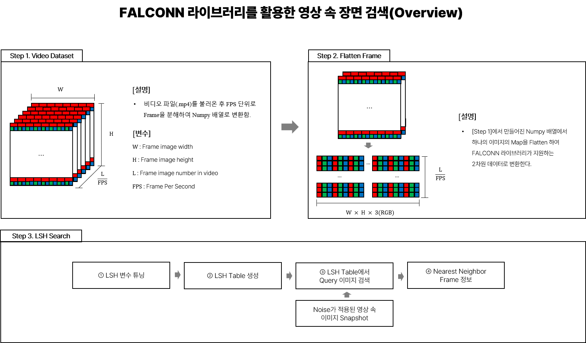

# FALCONN-Video-Frame-Search
Specific snapshot search in any resolution video via FALCONN Library

## 1. Introduction
해당 프로젝트는 '[FALCONN 라이브러리](https://github.com/FALCONN-LIB/FALCONN)' 라이브러리를 이용해서 비디오 속의 한 장면을 찾아내는 프로젝트입니다.

